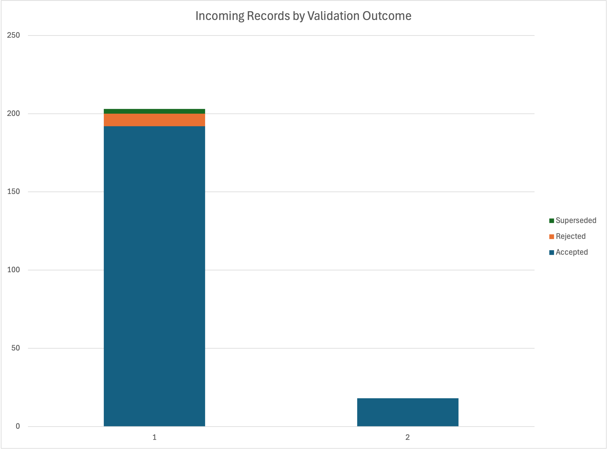
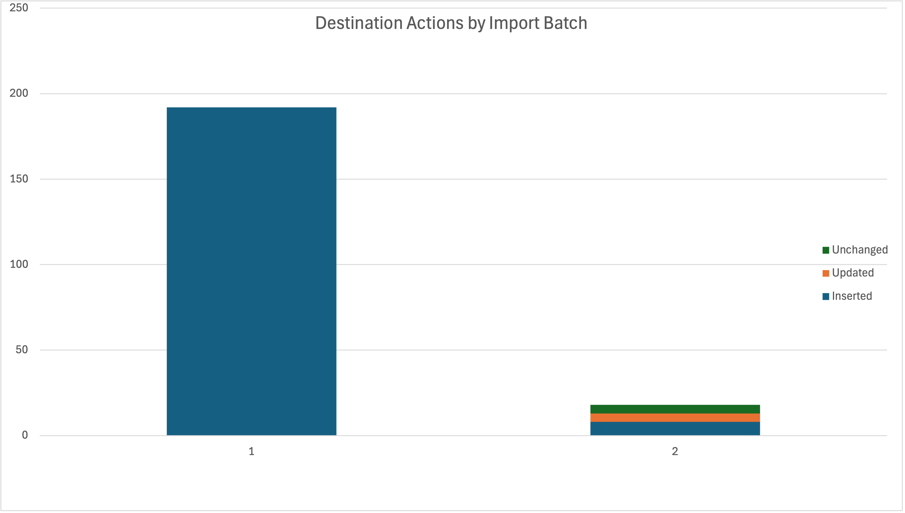

# Airline Booking Import and Reconciliation

**PostgreSQL · SQL / PL/pgSQL · pgAdmin · Excel**

A SQL data integration project that processes simulated airline booking updates, diagnoses data-quality issues, and loads valid records without overwriting newer data. Built around a verified sample of 200 bookings, the workflow demonstrates ETL, troubleshooting, transactional loading, and reconciliation.

## Data Source

The project uses the **2017 English small Airlines demonstration database** from [Postgres Professional](https://postgrespro.com/docs/postgrespro/13/demodb-bookings-installation.html).

Booking totals are verified against ticket-flight charges using `book_ref` and `ticket_no`. Two incoming batches contain deliberately introduced errors and update timestamps. The source is demonstration data; the imports are simulated.

## What the Project Demonstrates

- **Data validation:** Normalize identifiers and detect missing fields, malformed values, unknown references, and incorrect totals.
- **Deterministic deduplication:** Use `ROW_NUMBER()` to select the latest update, with a source-row tie-breaker.
- **Safe loading:** Use a PL/pgSQL procedure and timestamp-controlled `INSERT ... ON CONFLICT` to insert bookings and apply newer updates.
- **Traceability:** Save a disposition for every incoming row and an audit summary for each completed batch.
- **Repeatability and recovery:** Skip completed batches and verify that an unexpected constraint failure rolls back related writes.
- **Reconciliation:** Check completeness, reference values, latest updates, classifications, and audit counts.

## Results

The workflow processed **221 incoming rows across two batches** and produced **200 destination bookings**.

| Batch | Accepted | Rejected | Superseded | Inserted | Updated | Unchanged |
|---|---:|---:|---:|---:|---:|---:|
| 1 | 192 | 8 | 3 | 192 | 0 | 0 |
| 2 | 18 | 0 | 0 | 8 | 5 | 5 |

All **nine reconciliation checks passed**. Repeating a completed batch caused no additional changes. An intentional constraint failure verified rollback of destination changes, classifications, and the batch audit.

“Updated” means a newer source timestamp was applied; valid booking amounts remain equal to the reference. “Unchanged” identifies older updates prevented from overwriting newer destination records.

### Validation Outcomes

### Destination Actions

## SQL Files

| Script | Purpose |
|---|---|
| [01_setup.sql](sql/01_setup.sql) | Create tables, constraints, and the verified reference sample |
| [02_simulate_batches.sql](sql/02_simulate_batches.sql) | Generate incoming batches with controlled errors |
| [03_normalize_and_validate.sql](sql/03_normalize_and_validate.sql) | Safely parse fields, rank updates, and classify rows |
| [04_load.sql](sql/04_load.sql) | Load accepted records transactionally and audit each batch |
| [05_reconcile.sql](sql/05_reconcile.sql) | Run nine final integrity checks |
| [06_rollback_test.sql](sql/06_rollback_test.sql) | Test recovery from an intentional constraint failure |
| [07_reporting.sql](sql/07_reporting.sql) | Produce the summaries used in the charts |

## How to Run

1. Install PostgreSQL and pgAdmin, then restore the source SQL dump into a local development database. **The supplied dump recreates a database named `demo`.**
2. Connect pgAdmin's Query Tool to `demo` and run scripts **01–05 in order**. Scripts 01–02 are intended to run once on a fresh project setup.
3. Run **06 block by block** as instructed in its comments. The constraint error is intentional; execute `ROLLBACK`, verify the results, and clean up the test batch.
4. Run **07** to generate chart summaries. If verification queries follow a main script, highlight and execute each query separately to view its output.

To test repeated processing, call `integration.load_batch(2)` again. Completed batches are skipped; corrections belong in a new batch ID.

## Scope

Project objects live in the `integration` schema, preserving the original `bookings` tables. This is a local integration demonstration, not a production airline system. Pricing changes, refunds, APIs, SFTP, and large-scale performance testing are outside its scope.
